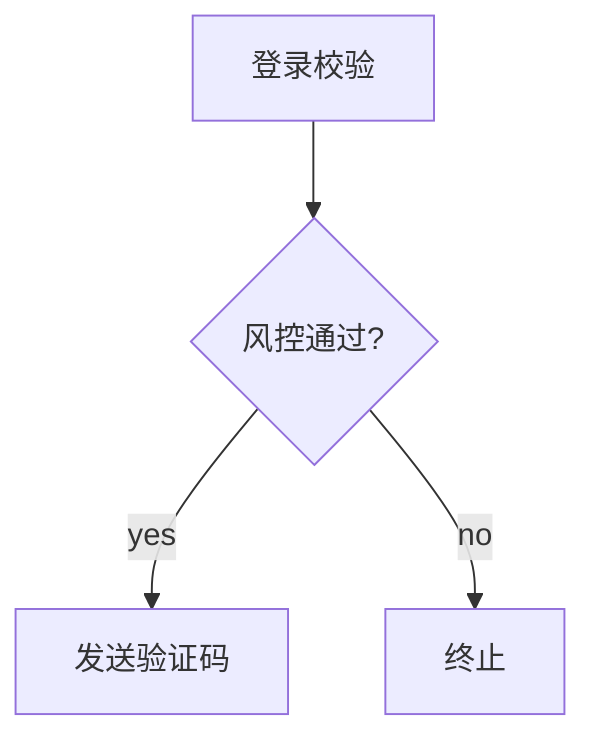

# 🐉 龙龙书签 · LongLong Bookmark

**JetBrains IDE 增强代码书签系统** - 让代码导航更高效！

> 支持 IntelliJ IDEA Community / Ultimate、PyCharm、WebStorm 等 JetBrains 系列 IDE (2020.1+)

## ✨ 核心功能

### 📚 智能书签
- **动态跟踪** - 代码变动自动跟踪位置（基于 RangeMarker）
- **别名注释** - 为书签添加易懂的名称和详细备注
- **颜色标记** - 9 种颜色视觉化区分不同类型
- **多标签** - 灵活的标签分类系统
- **失效提醒** - 代码删除后显示原代码，支持重新绑定

### 🗺️ 导览图系统
- **多种视图** - 主流程图、标签视图、自定义视图
- **丝滑操作** - 从节点边缘中点拖拽即可创建连线
- **画布缩放** - 滚轮缩放，支持 25%-300% 缩放
- **节点调整** - 拖拽4个顶点可调整节点大小
- **节点形状** - 矩形、圆角矩形、圆形、椭圆、菱形
- **节点颜色** - 可自定义节点颜色
- **双击编辑** - 双击节点/连线可编辑文字
- **书签标记** - 非书签节点显示红色警告标记
- **属性面板** - 选中节点/连线后可编辑详细属性
- **分栏编辑** - 支持在编辑器Tab中打开，可与代码并排显示
- **中英文切换** - 整个插件支持中英文动态切换，设置自动保存

### 📤 导入导出
- **JSON** - 完整配置，支持 AI 分析和回写
- **Markdown** - 文档格式，便于阅读
- **Mermaid** - 流程图格式，可嵌入文档

### 🔍 高效搜索
- 按别名、注释、代码内容搜索
- 按标签、文件名过滤
- 按颜色、状态分组

## 🚀 快速开始

### 安装
1. 下载插件包或从 JetBrains Marketplace 安装
2. 重启 IDE

### 使用
1. **添加书签**: `Ctrl+Shift+B` 或右键菜单 → 添加龙龙书签
2. **快速添加**: `Ctrl+Alt+B` 无对话框快速添加/删除
3. **查看书签**: `Ctrl+Shift+M` 或左侧工具栏 → 龙龙书签
4. **打开导览图**: 工具菜单 → 龙龙书签 → 打开导览图

## ⌨️ 快捷键

| 功能 | 快捷键 |
|------|--------|
| 添加书签（对话框） | `Ctrl+Shift+B` |
| 快速添加/删除书签 | `Ctrl+Alt+B` |
| 显示书签列表 | `Ctrl+Shift+M` |

## 📁 数据存储

书签数据存储在项目 `.idea` 目录下：
```
.idea/longlong-bookmarks.xml
```

## 🎨 支持的颜色

| 颜色 | 建议用途 |
|------|----------|
| 🔴 红色 | 重要/警告 |
| 🟠 橙色 | 待处理 |
| 🟡 黄色 | 注意事项 |
| 🟢 绿色 | 入口/正常 |
| 🔵 蓝色 | 默认/信息 |
| 🟣 紫色 | 特殊逻辑 |
| 💗 粉色 | 自定义 |
| 🔷 青色 | 自定义 |
| ⚪ 灰色 | 低优先级 |

## 🏷️ 预设标签

- **业务流程**: 入口、核心逻辑、数据校验、异常处理
- **技术标记**: RPC调用、数据库操作、缓存
- **状态标记**: 待优化、TODO、BUG

## 📋 导出格式示例

### JSON
```json
{
  "version": "1.0",
  "projectName": "MyProject",
  "bookmarks": [
    {
      "id": "xxx",
      "filePath": "src/main/UserService.java",
      "startLine": 120,
      "alias": "登录校验",
      "color": "BLUE",
      "tags": ["登录", "校验"],
      "comment": "检查密码是否正确"
    }
  ]
}
```

### Mermaid


## 🔧 开发

### 环境要求
- JDK 17+
- Gradle 8.5+ (或使用 IDE 内置 Gradle)

### 首次设置
1. 用 IntelliJ IDEA 打开项目
2. IDEA 会自动下载 Gradle Wrapper 和依赖
3. 等待索引完成

或手动初始化 Gradle Wrapper：
```bash
# 如果系统已安装 Gradle
gradle wrapper --gradle-version 8.5

# 然后构建
./gradlew build
```

### 构建
```bash
./gradlew build
```

### 运行测试 IDE
```bash
./gradlew runIde
```

### 打包
```bash
./gradlew buildPlugin
```

插件包位于 `build/distributions/`

## 📝 版本历史

### v1.0.0
- 初始版本发布
- 书签核心功能：添加、删除、跳转、动态跟踪
- 标签系统：多标签、颜色、分组
- 导览图系统：Main Flow、Tag Flow、Custom Flow
- 导入导出：JSON、Markdown、Mermaid

## 🤝 贡献

欢迎提交 Issue 和 Pull Request！

## 📄 许可证

MIT License

---

**🐉 龙龙书签** - 让代码导航更高效！
