# 🏰 BookmarkPalace · 书签宫殿

<p align="center">
  
</p>

<p align="center">
  <strong>JetBrains IDE 增强代码书签系统</strong><br>
  让代码导航更高效！告别迷失在代码海洋中的困扰！
</p>

<p align="center">
  
  
  
  
</p>

---

## 🌟 项目亮点

| 特性 | 描述 |
|------|------|
| 🎯 **智能追踪** | 基于 RangeMarker 技术，代码重构/编辑后书签位置自动更新 |
| 🗺️ **双引擎导览图** | Swing 原生编辑器 + Draw.io jCEF 专业编辑器可切换 |
| 🌍 **中英双语** | 完整的国际化支持，一键切换语言 |
| 🎨 **9色标记** | 视觉化书签分类，一眼识别重要程度 |
| 📤 **AI友好导出** | JSON/Markdown/Mermaid 格式，可直接与 AI 协作分析 |
| 🔄 **失效恢复** | 代码删除后保留原始快照，支持重新绑定 |
| ⚡ **快捷操作** | Alt+Enter 意图动作、Gutter 图标、快捷键全覆盖 |

---

## ✨ 核心功能

### 📚 智能书签
- **动态跟踪** - 代码变动自动跟踪位置（基于 RangeMarker）
- **别名注释** - 为书签添加易懂的名称和详细备注
- **颜色标记** - 9 种颜色视觉化区分不同类型
- **多标签** - 灵活的标签分类系统
- **失效提醒** - 代码删除后显示原代码快照，支持重新绑定
- **Gutter 图标** - 编辑器边栏显示书签标记，一目了然

### 🗺️ 导览图系统（独家功能）
- **双编辑器模式** - 原生 Swing（轻量快速）+ Draw.io jCEF（专业功能）可切换
- **多种视图** - 主流程图、标签视图、自定义视图
- **丝滑操作** - 从节点边缘中点拖拽即可创建连线
- **画布缩放** - 滚轮缩放，支持 25%-300% 缩放
- **节点调整** - 拖拽 4 个顶点可调整节点大小
- **节点形状** - 矩形、圆角矩形、圆形、椭圆、菱形
- **节点颜色** - 可自定义节点颜色
- **双击编辑** - 双击节点/连线可编辑文字
- **书签标记** - 非书签节点显示红色警告标记
- **属性面板** - 选中节点/连线后可编辑详细属性
- **分栏编辑** - 支持在编辑器 Tab 中打开，可与代码并排显示
- **中英文切换** - 整个插件支持中英文动态切换，设置自动保存
- **Draw.io 集成** - 可选使用专业的 Draw.io 编辑器（需 jCEF 支持）

### 📤 导入导出
- **JSON** - 完整配置，支持 AI 分析和回写
- **Markdown** - 文档格式，便于阅读和分享
- **Mermaid** - 流程图格式，可嵌入 GitHub/GitLab 文档

### 🔍 高效搜索
- 按别名、注释、代码内容搜索
- 按标签、文件名过滤
- 按颜色、状态分组（4 种分组模式）

## 🚀 快速开始

### 安装
1. 下载插件包或从 JetBrains Marketplace 安装
2. 重启 IDE

### 使用
1. **添加书签**: `Ctrl+Shift+B` 或右键菜单 → 添加书签
2. **快速添加**: `Ctrl+Alt+B` 无对话框快速添加/删除
3. **查看书签**: `Ctrl+Shift+M` 或左侧工具栏 → BookmarkPalace
4. **打开导览图**: 工具菜单 → BookmarkPalace → 打开导览图
5. **切换编辑器**: 工具菜单 → BookmarkPalace → 切换导览图编辑器（Swing ↔ Draw.io）

## ⌨️ 快捷键

| 功能 | 快捷键 |
|------|--------|
| 添加书签（对话框） | `Ctrl+Shift+B` |
| 快速添加/删除书签 | `Ctrl+Alt+B` |
| 显示书签列表 | `Ctrl+Shift+M` |

## 📁 数据存储

书签数据存储在项目 `.idea` 目录下：
```
.idea/longlong-bookmarks.xml
```

## 🎨 支持的颜色

| 颜色 | 建议用途 |
|------|----------|
| 🔴 红色 | 重要/警告 |
| 🟠 橙色 | 待处理 |
| 🟡 黄色 | 注意事项 |
| 🟢 绿色 | 入口/正常 |
| 🔵 蓝色 | 默认/信息 |
| 🟣 紫色 | 特殊逻辑 |
| 💗 粉色 | 自定义 |
| 🔷 青色 | 自定义 |
| ⚪ 灰色 | 低优先级 |

## 🏷️ 预设标签

- **业务流程**: 入口、核心逻辑、数据校验、异常处理
- **技术标记**: RPC调用、数据库操作、缓存
- **状态标记**: 待优化、TODO、BUG

## 🎨 导览图编辑器

### 原生 Swing 编辑器（默认）
- ✅ 轻量级，快速启动
- ✅ 无需网络连接
- ✅ 低内存占用（~10MB）
- ✅ 基础图形功能完整
- 适合快速草图和简单流程图

### Draw.io jCEF 编辑器（可选）
- ✅ 专业图表编辑能力
- ✅ 丰富的形状库（100+ 种）
- ✅ 高级样式和主题
- ✅ 自动布局和对齐
- ✅ 多格式导出（PNG、SVG、PDF）
- ⚠️ 需要 IntelliJ IDEA 2020.2+（jCEF 支持）
- ⚠️ 需要网络连接（加载 Draw.io Embed）
- ⚠️ 较高内存占用（~50MB）
- 适合专业流程图和复杂架构图

### 切换方式
```
工具菜单 → BookmarkPalace → 切换导览图编辑器
```

切换后需要重新打开导览图文件。

> 💡 **提示**: 查看完整的 Draw.io 集成文档 → [DRAWIO_INTEGRATION.md](DRAWIO_INTEGRATION.md)

## 📋 导出格式示例

### JSON
```json
{
  "version": "1.0",
  "projectName": "MyProject",
  "bookmarks": [
    {
      "id": "xxx",
      "filePath": "src/main/UserService.java",
      "startLine": 120,
      "alias": "登录校验",
      "color": "BLUE",
      "tags": ["登录", "校验"],
      "comment": "检查密码是否正确"
    }
  ]
}
```

### Mermaid


## 💼 应用场景

| 场景 | 描述 |
|------|------|
| **代码审查** | 标记可疑代码，用导览图串联问题点 |
| **学习源码** | 构建阅读路线，用 Mermaid 导出为文档 |
| **调试排查** | 标记断点位置，记录调试过程 |
| **与 AI 协作** | 导出 JSON 给 AI 分析，获取优化建议后回写 |
| **项目交接** | 导出书签分享给团队成员 |

## 🔧 开发

> 📖 完整的打包测试发布指南请查看 **[BUILD_AND_PUBLISH.md](BUILD_AND_PUBLISH.md)**

### 快速开始
```bash
# 构建
./gradlew build

# 运行测试 IDE
./gradlew runIde

# 打包
./gradlew buildPlugin
```

插件包位于 `build/distributions/`

## 📝 版本历史

### v1.0.0
- 初始版本发布
- 书签核心功能：添加、删除、跳转、动态跟踪
- 标签系统：多标签、颜色、分组
- 导览图系统：Main Flow、Tag Flow、Custom Flow
- 导入导出：JSON、Markdown、Mermaid
- 中英文国际化支持
- 双编辑器导览图（Swing + Draw.io jCEF）

## 🛠️ 技术栈

- **语言**: Kotlin 1.9
- **构建**: Gradle 8.5 + IntelliJ Platform Plugin 2.1.0
- **最低版本**: IntelliJ IDEA 2023.2 (Build 232)
- **最高版本**: IntelliJ IDEA 2024.3.x (Build 243.*)
- **JDK**: 17+

## 🤝 贡献

欢迎提交 Issue 和 Pull Request！

1. Fork 本仓库
2. 创建特性分支 (`git checkout -b feature/AmazingFeature`)
3. 提交更改 (`git commit -m 'Add some AmazingFeature'`)
4. 推送到分支 (`git push origin feature/AmazingFeature`)
5. 打开 Pull Request

## 📄 许可证

MIT License - 详见 [LICENSE](LICENSE) 文件

---

<p align="center">
  <strong>🏰 BookmarkPalace</strong> - 让代码导航更高效！<br>
  <sub>Made with ❤️ for developers</sub>
</p>
